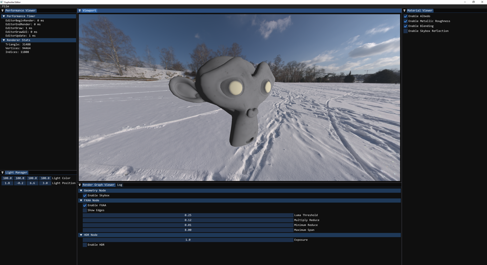

# Euphorbe


Euphorbe is a fresh early-stage game engine written entirely in C.
It's purpose is mainly to try and build an efficient yet developped Vulkan renderer, and this with the usage of the **VK_KHR_dynamic_rendering** extension.
***

# Getting started

Note that only MSVC is supported to build Euphorbe!

**1. Download the repository**
```bat
git clone https://github.com/Sausty/Euphorbe
install.bat
```

**2. Generate the project**
```bat
cmake -G "Visual Studio 17 2022" -B build
```

## Dependencies

- [volk](https://github.com/zeux/volk)
- [Vulkan-Headers](https://github.com/KhronosGroup/Vulkan-Headers)
- [shaderc](https://github.com/google/shaderc)
- [VMA](https://github.com/GPUOpen-LibrariesAndSDKs/VulkanMemoryAllocator)
- [SPIRV-Reflect](https://github.com/KhronosGroup/SPIRV-Reflect)
- [cimgui](https://github.com/Sausty/cimgui)
- [tomlc99](https://github.com/cktan/tomlc99)
- [cglm](https://github.com/recp/cglm)
- [cgltf](https://github.com/jkuhlmann/cgltf)

# Screenshots

## Screenshot from Jan 1 2022



## FXAA Demo
Without:\
\
### With:
\

## Current features

- Fully customisable render graph
- Vulkan backend
- Model loading (glTF) with cgltf
- HDR texture support
- Built-in editor
- Custom material file format
- Window management
- Input system
- Runtime shader compiling with shaderc
- Resource system
- GUI system with cimgui
- Timer
- FXAA anti-aliasing

## Additional information

**Note that you need the Beta Vulkan drivers to run this program!**
